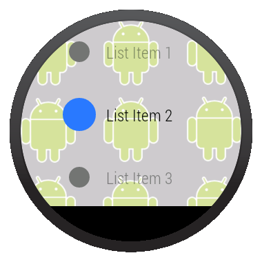

> 由于Wearable UI库从1.1版本开始发生了些改变，删除了部分接口、类和方法，并改变了实现方式，请先确认你的Wearable UI库的版本再查看对应的文档。

列表可以让用户在一系列选项中选择某一项。Wearable UI库包含WearableListView 类，是专为穿戴设备优化的实现类。

创建列表的步骤：

1、在你activity的布局中添加WearableListView 元素

2、创建一个自定义布局来实现你的list item

3、创建一个adapter装载进这个listview

## 添加一个listview ##

    <android.support.wearable.view.BoxInsetLayout
    xmlns:android="http://schemas.android.com/apk/res/android"
    xmlns:app="http://schemas.android.com/apk/res-auto"
    android:background="@drawable/robot_background"
    android:layout_height="match_parent"
    android:layout_width="match_parent">
     
    <FrameLayout
    android:id="@+id/frame_layout"
    android:layout_height="match_parent"
    android:layout_width="match_parent"
    app:layout_box="left|bottom|right">
     
    <android.support.wearable.view.WearableListView
    android:id="@+id/wearable_list"
    android:layout_height="match_parent"
    android:layout_width="match_parent">
    </android.support.wearable.view.WearableListView>
    </FrameLayout>
    </android.support.wearable.view.BoxInsetLayout>

## 创建listItem布局 ##

很多情况下，每个listItem都包含一个标题和一个图标。

下面这个布局实现了WearableListView.OnCenterProximityListener接口，并能在列表滚动的时候，让标题和图标带动画效果。

    
    public class WearableListItemLayout extends LinearLayout
    implements WearableListView.OnCenterProximityListener {
     
    private final float mFadedTextAlpha;
    private final int mFadedCircleColor;
    private final int mChosenCircleColor;
    private ImageView mCircle;
    private float mScale;
    private TextView mName;
     
    public WearableListItemLayout(Context context) {
    this(context, null);
    }
     
    public WearableListItemLayout(Context context, AttributeSet attrs) {
    this(context, attrs, 0);
    }
     
    public WearableListItemLayout(Context context, AttributeSet attrs,
      int defStyle) {
    super(context, attrs, defStyle);
    mFadedTextAlpha = getResources()
     .getInteger(R.integer.action_text_faded_alpha) / 100f;
    mFadedCircleColor = getResources().getColor(R.color.grey);
    mChosenCircleColor = getResources().getColor(R.color.blue);
    }
     
    // Get references to the icon and text in the item layout definition
    @Override
    protected void onFinishInflate() {
    super.onFinishInflate();
    // These are defined in the layout file for list items
    // (see next section)
    mCircle = (ImageView) findViewById(R.id.circle);
    mName = (TextView) findViewById(R.id.name);
    }
     
    @Override
	public void onCenterPosition(boolean b) {
		// TODO Auto-generated method stub
		mName.animate().alpha(1f).scaleX(1.1f).scaleY(1.1f);
		mCircle.animate().alpha(1f).scaleX(1.3f).scaleY(1.3f);
		
		((GradientDrawable) mCircle.getDrawable()).setColor(mChosenCircleColor);
	}

	@Override
	public void onNonCenterPosition(boolean b) {
		// TODO Auto-generated method stub
		mName.animate().alpha(0.5f).scaleX(1f).scaleY(1f);
		mCircle.animate().alpha(0.5f).scaleX(1f).scaleY(1f);
		
		((GradientDrawable) mCircle.getDrawable()).setColor(mFadedCircleColor);
	}
    }

## 创建listitem布局 ##

    
    <com.example.android.support.wearable.notifications.WearableListItemLayout
    xmlns:android="http://schemas.android.com/apk/res/android"
    android:gravity="center_vertical"
    android:layout_width="match_parent"
    android:layout_height="80dp">
    <ImageView
    android:id="@+id/circle"
    android:layout_height="20dp"
    android:layout_margin="16dp"
    android:layout_width="20dp"
    android:src="@drawable/wl_circle"/>
    <TextView
    android:id="@+id/name"
    android:gravity="center_vertical|left"
    android:layout_width="wrap_content"
    android:layout_marginRight="16dp"
    android:layout_height="match_parent"
    android:fontFamily="sans-serif-condensed-light"
    android:lineSpacingExtra="-4sp"
    android:textColor="@color/text_color"
    android:textSize="16sp"/>
    </com.example.android.support.wearable.notifications.WearableListItemLayout>

## 创建adapter ##

adapter用于对listview的内容填充。

    
    private static final class Adapter extends WearableListView.Adapter {
    private String[] mDataset;
    private final Context mContext;
    private final LayoutInflater mInflater;
     
    // Provide a suitable constructor (depends on the kind of dataset)
    public Adapter(Context context, String[] dataset) {
    mContext = context;
    mInflater = LayoutInflater.from(context);
    mDataset = dataset;
    }
     
    // Provide a reference to the type of views you're using
    public static class ItemViewHolder extends WearableListView.ViewHolder {
    private TextView textView;
    public ItemViewHolder(View itemView) {
    super(itemView);
    // find the text view within the custom item's layout
    textView = (TextView) itemView.findViewById(R.id.name);
    }
    }
     
    // Create new views for list items
    // (invoked by the WearableListView's layout manager)
    @Override
    public WearableListView.ViewHolder onCreateViewHolder(ViewGroup parent,
      int viewType) {
    // Inflate our custom layout for list items
    return new ItemViewHolder(mInflater.inflate(R.layout.list_item, null));
    }
     
    // Replace the contents of a list item
    // Instead of creating new views, the list tries to recycle existing ones
    // (invoked by the WearableListView's layout manager)
    @Override
    public void onBindViewHolder(WearableListView.ViewHolder holder,
     int position) {
    // retrieve the text view
    ItemViewHolder itemHolder = (ItemViewHolder) holder;
    TextView view = itemHolder.textView;
    // replace text contents
    view.setText(mDataset[position]);
    // replace list item's metadata
    holder.itemView.setTag(position);
    }
     
    // Return the size of your dataset
    // (invoked by the WearableListView's layout manager)
    @Override
    public int getItemCount() {
    return mDataset.length;
    }
    }

## 关联adapter并设置点击事件 ##

在你的activity中获取WearableListView 的引用，并设置一个adapter实例，再设置用户点击item的触发的事件。

    
    public class WearActivity extends Activity
      implements WearableListView.ClickListener {
     
    // Sample dataset for the list
    String[] elements = { "List Item 1", "List Item 2", ... };
     
    @Override
    protected void onCreate(Bundle savedInstanceState) {
    super.onCreate(savedInstanceState);
    setContentView(R.layout.my_list_activity);
     
    // Get the list component from the layout of the activity
    WearableListView listView =
    (WearableListView) findViewById(R.id.wearable_list);
     
    // Assign an adapter to the list
    listView.setAdapter(new Adapter(this, elements));
     
    // Set a click listener
    listView.setClickListener(this);
    }
     
    // WearableListView click listener
    @Override
    public void onClick(WearableListView.ViewHolder v) {
    Integer tag = (Integer) v.itemView.getTag();
    // use this data to complete some action ...
    }
     
    @Override
    public void onTopEmptyRegionClick() {
    }
    }
    