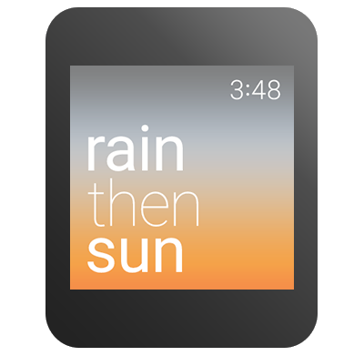

除了告知时间，Android Wear设备还能提供给用户与情景相关的信息，以卡片、通知和App的形式。

就想其他android wear app一样，你的表盘也能通过数据层API跟手持设备进行交流。这些示例中，你需要在手持设备app工程中创建一个Activity来接收intent数据，并且在表盘上显示他们。

## 创建一个引人入胜的体验 ##

在你创建一个情景感知的表盘前，回答以下问题：

- 你想结合什么类型的数据
- 你要在哪包含这些数据
- 你如何更新数据
- 你想如何呈现数据让用户便于理解

Android Wear设备通常会跟带有gps传感器和移动网络的设备进行配对，所以你有无限种可能来设想你的表盘能整合的数据类型，例如地理位置，日历事件，社交媒体，图片流，股市行情，新闻事件，体育比分等等。可是，不是所有类型的数据都建议显示在表盘上，所以你需要考虑什么类型的数据跟用户每天的情景是关联的。当android wear设备没有跟手持设备配对或者网络连接无效的时候，你的表盘也应该可以完美的处理。

被激活的表盘是个持续运行的应用，所以你需要考虑有效的续航问题。例如你可以每十分钟获取一次当前天气并存储在本地，而不是每分钟频繁的更新。你也可以当设备模式切换的时候刷新情景数据，因为用户很可能是瞥一眼手表。

你应该在表盘上显示简要的信息，因为屏幕上只有有限的空间，并且用户只是会用1到2秒来瞥一眼手表。有时传递情景信息最好的方式是反应到使用的图片和颜色上。例如表盘可以根据当前天气改变背景图。

## 给表盘添加数据 ##

Android SDK中有表盘示例代码，在CalendarWatchFaceService 类中展示如何获取日历的用户配置数据，以及显示在未来的24小时有多少会议。
这个示例的位置在android-sdk/samples/android-21/wearable/WatchFace目录下。

为了实现包含情景数据的表盘，通过以下几步：

1. 提供拉取数据的task
2. 创建一个自定义的定时器来周期性调用你的task，或者外部数据发生改变时通知你的表盘services
3. 用更新的数据重绘你的表盘

**提供拉取数据的task**

创建一个类继承AsyncTask，并添加拉取数据的代码

CalendarWatchFaceService类包含了下一天的会议数量：

    /* Asynchronous task to load the meetings from the content provider and
     * report the number of meetings back using onMeetingsLoaded() */
    private class LoadMeetingsTask extends AsyncTask<Void, Void, Integer> {
    @Override
    protected Integer doInBackground(Void... voids) {
    long begin = System.currentTimeMillis();
    Uri.Builder builder =
    WearableCalendarContract.Instances.CONTENT_URI.buildUpon();
    ContentUris.appendId(builder, begin);
    ContentUris.appendId(builder, begin + DateUtils.DAY_IN_MILLIS);
    final Cursor cursor = getContentResolver() .query(builder.build(),
    null, null, null, null);
    int numMeetings = cursor.getCount();
    if (Log.isLoggable(TAG, Log.VERBOSE)) {
    Log.v(TAG, "Num meetings: " + numMeetings);
    }
    return numMeetings;
    }
    
    @Override
    protected void onPostExecute(Integer result) {
    /* get the number of meetings and set the next timer tick */
    onMeetingsLoaded(result);
    }
    }

Wearable Support Library中的WearableCalendarContract类提供直接访问配对设备中用户日历事件。

当任务完成拉取数据后，你的代码会调用一个回调方法。下面讲述如何实现回调方法。

更多关于获取日历数据的详情，查看[Calendar Provider](https://developer.android.com/guide/topics/providers/calendar-provider.html)

**创建自定义定时器**

你能实现一个自定义定时器来周期性刷新数据。CalendarWatchFaceService类使用一个handler实例利用线程消息队列来发送和处理延迟消息。

    private class Engine extends CanvasWatchFaceService.Engine {
    ...
    int mNumMeetings;
    private AsyncTask<Void, Void, Integer> mLoadMeetingsTask;
    
    /* Handler to load the meetings once a minute in interactive mode. */
    final Handler mLoadMeetingsHandler = new Handler() {
    @Override
    public void handleMessage(Message message) {
    switch (message.what) {
    case MSG_LOAD_MEETINGS:
    cancelLoadMeetingTask();
    mLoadMeetingsTask = new LoadMeetingsTask();
    mLoadMeetingsTask.execute();
    break;
    }
    }
    };
    ...
    }

当表盘可见的时候，这个方法来初始化定时器：

    @Override
    public void onVisibilityChanged(boolean visible) {
    super.onVisibilityChanged(visible);
    if (visible) {
    mLoadMeetingsHandler.sendEmptyMessage(MSG_LOAD_MEETINGS);
    } else {
    mLoadMeetingsHandler.removeMessages(MSG_LOAD_MEETINGS);
    cancelLoadMeetingTask();
    }
    }

**用更新的数据重绘你的表盘**

当task拉取完数据后，调用invalidate()方法，这样系统会重绘你的表盘。在Engine 类的成员变量中存储数据，这样你在onDraw()方法中就访问它。

CalendarWatchFaceService 类提供一个回调函数给task，当抽取日历数据结束后会调用它:

    private void onMeetingsLoaded(Integer result) {
    if (result != null) {
    mNumMeetings = result;
    invalidate();
    }
    if (isVisible()) {
    mLoadMeetingsHandler.sendEmptyMessageDelayed(
    MSG_LOAD_MEETINGS, LOAD_MEETINGS_DELAY_MS);
    }
    }

这个回调函数在成员变量中存储了结果，刷新了view，并且下次定时器触发的时候会再次执行任务。