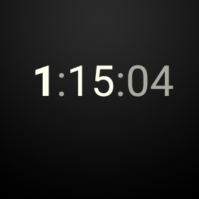

当你配置完工程并且添加了实现表盘service的类后，你可以开始初始化并绘制表盘。Android SDK中包含表盘示例，示例位置在android-sdk/samples/android-21/wearable/WatchFace目录下。service很多方面的实现描述都在这里面，例如初始化和检测设备功能，可以应用于任何表盘，所以你可以在你的表盘中复用这些代码。

## 初始化你的表盘 ##

当系统加载你的service，你应该分配和初始化大部分表盘所需的资源，包括加载bitmap资源，创建定时器对象来运行自定义动画，配置paint对象和风格，以及执行其他计算。你可以只执行一次这些操作并且复用他们的执行结果。这样可以提高表盘的性能。

初始化表盘有以下几步：

1. 声明自定义定时器变量，图像对象和其他元素。
2. 在Engine.onCreate()方法中初始化表盘元素。
3. 在Engine.onVisibilityChanged()方法中初始化自定义的定时器。

**初始化变量**

当系统加载你的service的时候，会在不同的实现地方访问你所初始化的资源，所以你可以复用它们。你可以在你的WatchFaceService.Engine实现中声明这些资源变量。

为下面这些元素声明变量：

图像对象

	大部分表盘至少包含一个bitmap图片作为表盘背景图，你可以使用其他bitmap图片来呈现时钟指针或其他表盘设计元素。

定时器

	当时间改变的时候系统每分钟通知一次表盘，但一些表盘会在自定义的时间间隔下显示动画。在这些案例中，你需要提供一个自定义的定时器来频繁刷新你的表盘。

时区变化receiver

	当用户在旅行途中他们可以自适应时区，系统会发送事件广播。你的service必须注册一个广播的receiver，当时区发生改变和更新的时候会受到通知。

在表盘代码示例中的AnalogWatchFaceService.Engine类简单的定义了这些变量。自定义定时器实现了一个handler实例，使用线程消息队列来发送和处理延迟消息。在这个表盘示例中，自定义的定时器每秒触发一次。当定时器触发的时候，handler会调用invalid（）方法，并且系统之后会调用ondraw（）方法来重绘表盘。

    private class Engine extends CanvasWatchFaceService.Engine {
    static final int MSG_UPDATE_TIME = 0;
    
    /* a time object */
    Time mTime;
    
    /* device features */
    boolean mLowBitAmbient;
    
    /* graphic objects */
    Bitmap mBackgroundBitmap;
    Bitmap mBackgroundScaledBitmap;
    Paint mHourPaint;
    Paint mMinutePaint;
    ...
    
    /* handler to update the time once a second in interactive mode */
    final Handler mUpdateTimeHandler = new Handler() {
    @Override
    public void handleMessage(Message message) {
    switch (message.what) {
    case MSG_UPDATE_TIME:
    invalidate();
    if (shouldTimerBeRunning()) {
    long timeMs = System.currentTimeMillis();
    long delayMs = INTERACTIVE_UPDATE_RATE_MS
    - (timeMs % INTERACTIVE_UPDATE_RATE_MS);
    mUpdateTimeHandler
    .sendEmptyMessageDelayed(MSG_UPDATE_TIME, delayMs);
    }
    break;
    }
    }
    };
    
    /* receiver to update the time zone */
    final BroadcastReceiver mTimeZoneReceiver = new BroadcastReceiver() {
    @Override
    public void onReceive(Context context, Intent intent) {
    mTime.clear(intent.getStringExtra("time-zone"));
    mTime.setToNow();
    }
    };
    
    /* service methods (see other sections) */
    ...
    }
	

**初始化表盘元素**

在你为bitmap资源，paint对象类型，以及其他你每次重绘表盘都需要复用的元素声明了成员变量后，
在系统加载你的service时初始化它们。只需要初始化一次这些元素并复用他们，这样可以提高性能和电池续航。

在Engine.onCreate()方法里，初始化以下元素：

- 加载背景图
- 创建样式和颜色来绘制图形对象
- 分配一个time对象的引用
- 配置系统UI

 AnalogWatchFaceService类中的Engine.onCreate()方法初始化了这些元素：

    @Override
    public void onCreate(SurfaceHolder holder) {
    super.onCreate(holder);
    
    /* configure the system UI (see next section) */
    ...
    
    /* load the background image */
    Resources resources = AnalogWatchFaceService.this.getResources();
    Drawable backgroundDrawable = resources.getDrawable(R.drawable.bg);
    mBackgroundBitmap = ((BitmapDrawable) backgroundDrawable).getBitmap();
    
    /* create graphic styles */
    mHourPaint = new Paint();
    mHourPaint.setARGB(255, 200, 200, 200);
    mHourPaint.setStrokeWidth(5.0f);
    mHourPaint.setAntiAlias(true);
    mHourPaint.setStrokeCap(Paint.Cap.ROUND);
    ...
    
    /* allocate an object to hold the time */
    mTime = new Time();
    }

当系统初始化表盘的时候背景图只需要加载一次。

**初始化自定义定时器**

作为表盘开发者，你要决定你的表盘多久刷新，当设备处于交互模式下利用自定义的定时器来触发频繁更新。这样还能让你创建自定义动画和其他视觉效果。

> 注意：在环境模式下，系统不一定会调用自定义定时器。

在AnalogWatchFaceService 类中定义的示例定时器，每秒钟会触发显示一次声明的变量资源。在Engine.onVisibilityChanged()方法中，如果两个条件同时满足了就会启动自定义定时器：

- 表盘可见
- 设备处于交互模式

    private void updateTimer() {
    mUpdateTimeHandler.removeMessages(MSG_UPDATE_TIME);
    if (shouldTimerBeRunning()) {
    mUpdateTimeHandler.sendEmptyMessage(MSG_UPDATE_TIME);
    }
    }
    
    private boolean shouldTimerBeRunning() {
    return isVisible() && !isInAmbientMode();
    }

在Engine.onVisibilityChanged()方法中，启动定时器并注册时区变化的receiver：

    @Override
    public void onVisibilityChanged(boolean visible) {
    super.onVisibilityChanged(visible);
    
    if (visible) {
    registerReceiver();
    
    // Update time zone in case it changed while we weren't visible.
    mTime.clear(TimeZone.getDefault().getID());
    mTime.setToNow();
    } else {
    unregisterReceiver();
    }
    
    // Whether the timer should be running depends on whether we're visible and
    // whether we're in ambient mode), so we may need to start or stop the timer
    updateTimer();
    }
	

当表盘不可见时，停止自定义的定时器并且注销时区变化的receiver。

    private void registerReceiver() {
    if (mRegisteredTimeZoneReceiver) {
    return;
    }
    mRegisteredTimeZoneReceiver = true;
    IntentFilter filter = new IntentFilter(Intent.ACTION_TIMEZONE_CHANGED);
    AnalogWatchFaceService.this.registerReceiver(mTimeZoneReceiver, filter);
    }
    
    private void unregisterReceiver() {
    if (!mRegisteredTimeZoneReceiver) {
    return;
    }
    mRegisteredTimeZoneReceiver = false;
    AnalogWatchFaceService.this.unregisterReceiver(mTimeZoneReceiver);
    }

**在环境模式下刷新表盘**

在环境模式下，系统每分钟调用一次 Engine.onTimeTick()方法。在这个模式下，每分钟刷新一次表盘足够了。

在环境模式下，大部分表盘只要在Engine.onTimeTick()方法中简单调用invalidate方法就可以重绘你的表盘。

    @Override
    public void onTimeTick() {
    super.onTimeTick();
    
    invalidate();
    }

## 配置系统UI ##

表盘不应该干扰系统UI元素。如果你的表盘有个亮的背景或者在屏幕底部要显示信息，你就必须配置通知卡片的大小，或者开启背景保护。

当你的表盘处于激活状态，Android Wear能让你配置以下几方面系统UI：

- 指定第一个通知卡片在屏幕中的范围
- 指定系统是否在你的表盘上绘制时间
- 在环境模式下显示或隐藏卡片
- 用一个实体背景来包裹系统指示器
- 指定系统指示器位置

为了配置系统UI的这些方面，创建一个WatchFaceStyle实例并把它传给Engine.setWatchFaceStyle()方法。

    @Override
    public void onCreate(SurfaceHolder holder) {
    super.onCreate(holder);
    
    /* configure the system UI */
    setWatchFaceStyle(new WatchFaceStyle.Builder(AnalogWatchFaceService.this)
    .setCardPeekMode(WatchFaceStyle.PEEK_MODE_SHORT)
    .setBackgroundVisibility(WatchFaceStyle
    .BACKGROUND_VISIBILITY_INTERRUPTIVE)
    .setShowSystemUiTime(false)
    .build());
    ...
    }

上面的代码片段配置了以单行高度显示通知卡片，卡片的背景只会简单的显示且只用于终止通知，并且系统时间不会显示（这样表盘需要自己绘制时间）。

在你的表盘实现中，你可以在任何地方配置系统UI风格。例如如果用户选择了一个白色背景，你可以为系统指示器添加背景保护。

更多详情可以查看WatchFaceStyle类的[API reference](https://developer.android.com/shareables/training/wearable-support-docs.zip)

## 获取设备屏幕信息 ##

当系统确定了设备屏幕属性后会调用Engine.onPropertiesChanged()方法，例如设备是否使用了低比特的环境模式，以及屏幕是否需要老化保护。

    @Override
    public void onPropertiesChanged(Bundle properties) {
    super.onPropertiesChanged(properties);
    mLowBitAmbient = properties.getBoolean(PROPERTY_LOW_BIT_AMBIENT, false);
    mBurnInProtection = properties.getBoolean(PROPERTY_BURN_IN_PROTECTION,
    false);
    }

当你绘制表盘的时候，你需要考虑到这些设备属性：

- 当设备使用了低比特环境模式，屏幕只支持更少的位颜色，所以你需要关闭抗锯齿。
- 当设备需要老化保护，在环境模式下避免使用大块的白色像素，并且不要把内容放进屏幕10像素的边框中，因为系统会定时的变化内容来防止像素老化。（这有点像windows电脑屏保的作用）

## 响应模式切换 ##

当设备在环境模式和交互模式间切换时，系统会调用Engine.onAmbientModeChanged()方法。你的service需要自适应模式间的切换，并且调用invalidate方法来让系统重绘你的表盘。

    @Override
    public void onAmbientModeChanged(boolean inAmbientMode) {
    
    super.onAmbientModeChanged(inAmbientMode);
    
    if (mLowBitAmbient) {
    boolean antiAlias = !inAmbientMode;
    mHourPaint.setAntiAlias(antiAlias);
    mMinutePaint.setAntiAlias(antiAlias);
    mSecondPaint.setAntiAlias(antiAlias);
    mTickPaint.setAntiAlias(antiAlias);
    }
    invalidate();
    updateTimer();
    }

## 绘制表盘 ##

为了绘制自定义表盘，系统会调用Engine.onDraw()方法，并传入一个Canvas示例和Rect示例，Rect表示你绘制表盘的区域。你可以使用这个canvas对象来直接绘制你的表盘：

1. 如果是第一次调用onDraw（）方法，缩放背景来适应屏幕
2. 检测设备是在环境模式还是交互模式
3. 执行任何需要的图形计算
4. 绘制背景bitmap到canvas上
5. 使用Canvas类的方法来绘制表盘

    @Override
    public void onDraw(Canvas canvas, Rect bounds) {
    // Update the time
    mTime.setToNow();
    
    int width = bounds.width();
    int height = bounds.height();
    
    // Draw the background, scaled to fit.
    if (mBackgroundScaledBitmap == null
    || mBackgroundScaledBitmap.getWidth() != width
    || mBackgroundScaledBitmap.getHeight() != height) {
    mBackgroundScaledBitmap = Bitmap.createScaledBitmap(mBackgroundBitmap,
     width, height, true /* filter */);
    }
    canvas.drawBitmap(mBackgroundScaledBitmap, 0, 0, null);
    
    // Find the center. Ignore the window insets so that, on round watches
    // with a "chin", the watch face is centered on the entire screen, not
    // just the usable portion.
    float centerX = width / 2f;
    float centerY = height / 2f;
    
    // Compute rotations and lengths for the clock hands.
    float secRot = mTime.second / 30f * (float) Math.PI;
    int minutes = mTime.minute;
    float minRot = minutes / 30f * (float) Math.PI;
    float hrRot = ((mTime.hour + (minutes / 60f)) / 6f ) * (float) Math.PI;
    
    float secLength = centerX - 20;
    float minLength = centerX - 40;
    float hrLength = centerX - 80;
    
    // Only draw the second hand in interactive mode.
    if (!isInAmbientMode()) {
    float secX = (float) Math.sin(secRot) * secLength;
    float secY = (float) -Math.cos(secRot) * secLength;
    canvas.drawLine(centerX, centerY, centerX + secX, centerY +
    secY, mSecondPaint);
    }
    
    // Draw the minute and hour hands.
    float minX = (float) Math.sin(minRot) * minLength;
    float minY = (float) -Math.cos(minRot) * minLength;
    canvas.drawLine(centerX, centerY, centerX + minX, centerY + minY,
    mMinutePaint);
    float hrX = (float) Math.sin(hrRot) * hrLength;
    float hrY = (float) -Math.cos(hrRot) * hrLength;
    canvas.drawLine(centerX, centerY, centerX + hrX, centerY + hrY,
    mHourPaint);
    }

根据当前时间计算时钟指针需要指向的位置，在背景图上层绘制它们。秒针只能在交互模式中被绘制，不能在环境模式下绘制。