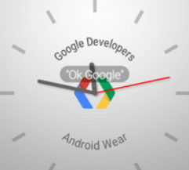

创建自定义表盘大体上和创建通知及android wear的activity不太一样。
下面将介绍如何解决些常见问题。

## 检测屏幕形状 ##

一些android wewar设备有方形屏幕，另一些有圆形屏幕。圆形屏幕的设备能在屏幕底部包含一个插图。你的表盘也需要适配这种特殊屏幕形状。

android wear可以让你在运行时确定屏幕形状。为了检测屏幕是圆形还是方形，在CanvasWatchFaceService.Engine类中重写onApplyWindowInsets（）方法：

    private class Engine extends CanvasWatchFaceService.Engine {
    boolean mIsRound;
    int mChinSize;
    
    @Override
    public void onApplyWindowInsets(WindowInsets insets) {
    super.onApplyWindowInsets(insets);
    mIsRound = insets.isRound();
    mChinSize = insets.getSystemWindowInsetBottom();
    }
    ...
    }

当你要绘制表盘的时候适配好你的设计，检查mIsRound 和mChinSize 这两个成员变量。

## 容纳peek卡片 ##

当用户接受一个通知时，通知卡片可能会盖住屏幕重要的一部分。你的表盘应该能适配这种情况，以便用户依然可以看到表盘上的时间。

当通知卡片出现的时候，模拟时钟表盘可以做个调整，例如缩小表盘以适配在屏幕中的位置，这样就不会被peek卡片挡住了。数字表盘显示时间的区域一般不会被peek卡片挡住，所以通常不需要调整。确定peek卡片上方的空白区域，以便你可以适配你的表盘，可以使用WatchFaceService.getPeekCardPosition()方法。

在环境模式下，peek卡片有个透明背景。如果你的表盘在卡片附近包含了显示信息，可以考虑绘制一个黑色矩形来包裹它们，确保用户可以看清卡片内容。

## 配置指示器颜色 ##

确保系统指示器能保持可见，你可以创建一个WatchFaceStyle实例来在屏幕上配置它们的位置以及是否需要背景保护：

- 设置状态栏位置，使用 setStatusBarGravity()方法
- 设置热词位置，使用setHotwordIndicatorGravity()方法
- 用半透明灰色背景保护状态栏和热词，使用setViewProtection()方法。如果你的表盘有个高亮背景的话这样很有必要，因为系统指示器是白色的。

## 使用相对尺寸 ##

android wear设备的屏幕由于由不同厂商生产，所以会有各种尺寸和分辨率。你的表盘应该可以适配这些不同，通过使用相对尺寸，不要使用绝对像素值。

当你绘制表盘的时候，通过 Canvas.getWidth()和Canvas.getHeight()方法获取画布尺寸，并以此来设置图形元素的位置。如果你为了响应peek卡片而重新调整表盘元素的大小，你可以计算卡片上方的剩余空间大小来重绘表盘。