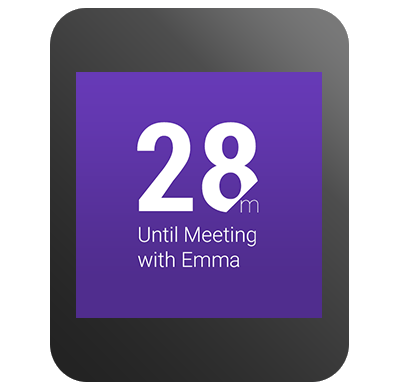
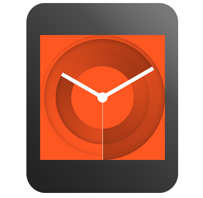

类似于设计传统表盘的过程一样，创建一个android wear表盘也需要明确的显示时间。android wear设备能为表盘提供高级特性，你可以在你的设计中使用，例如明亮的颜色，动态背景，动画及整合数据。但有很多设计考虑你需要去重视。

## 遵循设计规范 ##

当你准备在表盘上给用户呈现信息的时候，考虑这些设计规范：

考虑方形和圆形设备

	你应该设计的能同时在方形和圆形设备上运行

支持所有显示模式

	你的表盘应该通过用有限的颜色来支持环境模式，并且用全彩色动画来交互

为特殊的屏幕技术而优化

	在环境模式中，你的表盘应该保持大部分黑色像素。根据屏幕技术，你要避免例如大块的白色像素、只是用黑色和白色、禁用抗锯齿。

融合系统UI元素

	你的设计应该确保系统指示物有预留的显示空间，并且当通知卡片出现在屏幕上时，用户依然可以看到时间。

整合数据

	你的表盘可以利用传感器并且显示配对设备上的关联情景数据，例如今天天气，下一个日历时间。

提供选择项

	你可以让用户为你的设计配置一些属性，例如颜色尺寸。

> 更多相关表盘设计，可查看穿戴猫论坛中原创编译的android wear表盘设计规范

## 创建一个实现策略 ##

当你的表盘设计定稿后，你需要决定如何获取必要数据并绘制在表盘上。大部分实现包含以下几部分：

1. 一张或更多的背景图
2. 获取必要数据的程序代码
3. 在背景图上绘制文字和图形的程序代码

android wear设备背景图的hdpi屏幕分辨率是320*320，适配方形和原型屏幕。在代码中，你可以检测屏幕尺寸，当设备屏幕分辨率低的时候，缩放你的背景图。为了提高性能，你应该只缩放一次背景图并保存bitmap。

当你要获取常用的情景数据的时候，应该能复用这些数据。例如你不需要每分钟都去获取天气数据更新。

为了增加电池寿命，在环境模式中绘制表盘的程序代码已经尽量简单，并使用有限的颜色绘制图形轮廓。在交互模式中，你可以使用全部颜色，复杂的图形，渐变和动画来绘制你的表盘。